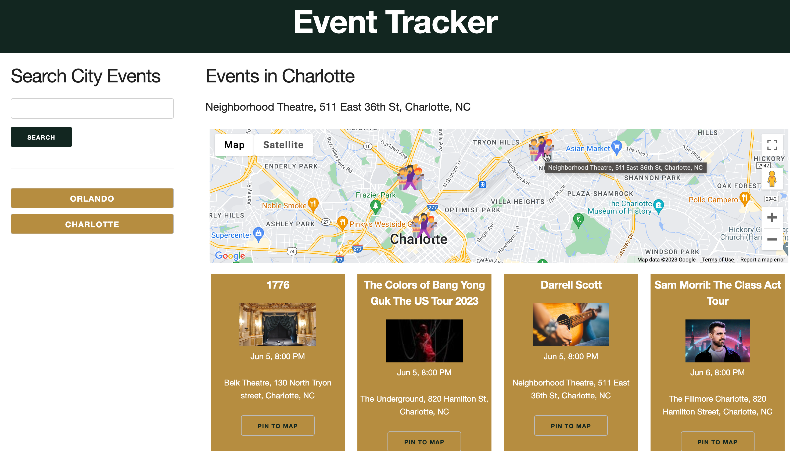

# Event Tracker
## Description

<!-- Provide a short description explaining the what, why, and how of your project. Use the following questions as a guide: -->

-  The motivation behind this project is to allow tourists have easy access to events that are currently in the area, as well a access to the current weather. 
- This project was built to..
- The problem that this application solves is it allows for user to have knowledge on current events in the area as well as the corresponding weather to avoid any conflict in plans. 
- We learned..

## Table of Contents (Optional)

<!-- If your README is long, add a table of contents to make it easy for users to find what they need.

- [Installation](#installation)
- [Usage](#usage)
- [Credits](#credits)
- [License](#license) -->

## Installation

In order to install this project the user must clickk on the deployment link and the application will open up. 

<!-- What are the steps required to install your project? Provide a step-by-step description of how to get the development environment running. -->

## Usage

When you click on the deploment link, the application opens up and the user is greeted with a the main page. From there the user can search their desired city/location and find a list of events along with the weather for that timeframe.
Provide instructions and examples for use. Include screenshots as needed.

<!-- To add a screenshot, create an `assets/images` folder in your repository and upload your screenshot to it. Then, using the relative filepath, add it to your README using the following syntax: -->

    ```md
    
    ```

## Credits

<!-- List your collaborators, if any, with links to their GitHub profiles. -->
List of collaborators:
https://github.com/ashleyemfernandez
https://github.com/Christina2208
https://github.com/djamiranda

<!-- If you used any third-party assets that require attribution, list the creators with links to their primary web presence in this section. -->

Third Party Assets:
http://getskeleton.com

<!-- If you followed tutorials, include links to those here as well. -->

Tutorials:

## License

<!-- The last section of a high-quality README file is the license. This lets other developers know what they can and cannot do with your project. If you need help choosing a license, refer to [https://choosealicense.com/](https://choosealicense.com/).

---

🏆 The previous sections are the bare minimum, and your project will ultimately determine the content of this document. You might also want to consider adding the following sections. -->

## Badges

<!-- 

Badges aren't necessary, per se, but they demonstrate street cred. Badges let other developers know that you know what you're doing. Check out the badges hosted by [shields.io](https://shields.io/). You may not understand what they all represent now, but you will in time. -->

## Features

<!-- If your project has a lot of features, list them here. -->

## How to Contribute

<!-- If you created an application or package and would like other developers to contribute it, you can include guidelines for how to do so. The [Contributor Covenant](https://www.contributor-covenant.org/) is an industry standard, but you can always write your own if you'd prefer. -->

## Tests

